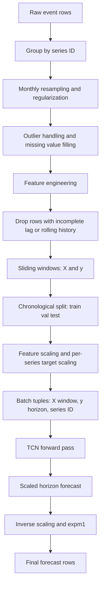
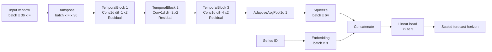

# TCN Architecture

This document describes the Temporal Convolutional Network implemented in this repository. It is based on the current source in `src/model.py`, `src/data.py`, `src/trainer.py`, `src/pipeline.py`, and `src/config.py`.

## 1. Layers and Architecture Components

### Model family

The forecasting model is a **Temporal Convolutional Network (TCN)** for multi-step forecasting across many parallel time series.

At a high level, the model does this:

1. Takes a fixed-length history window for one series.
2. Runs that window through a stack of **causal dilated Conv1d residual blocks**.
3. Collapses the time axis with **adaptive average pooling**.
4. Concatenates a learned **series ID embedding**.
5. Produces a multi-step forecast with a final **linear layer**.

### Exact layers used

The implemented network uses the following layers.

#### Input

- Input tensor shape before the network: `(batch, window_size, n_features)`
- Default `window_size = 36`
- Default engineered feature count: `24` plus optional exogenous columns

#### Temporal block

Each `TemporalBlock` contains:

1. `Conv1d(in_ch, out_ch, kernel_size, dilation=d, padding=(kernel_size - 1) * d)`
2. `Chomp1d(padding)` to remove future-looking padded positions and preserve causality
3. `ReLU`
4. `Dropout`
5. `Conv1d(out_ch, out_ch, kernel_size, dilation=d, padding=(kernel_size - 1) * d)`
6. `Chomp1d(padding)`
7. `ReLU`
8. `Dropout`
9. Residual addition
10. Final `ReLU`

Both convolutions inside the block use **weight normalization**.

If `in_ch != out_ch`, the residual branch uses a `1 x 1` convolution:

- `Conv1d(in_ch, out_ch, kernel_size=1)`

#### TCN stack

The model stacks multiple temporal blocks in sequence.

Default training config:

- `num_channels = (64, 64, 64)`
- `kernel_size = 3`
- `dropout = 0.2`

This gives three temporal blocks with dilations:

- Block 1: dilation `1`
- Block 2: dilation `2`
- Block 3: dilation `4`

#### Output head

After the TCN stack:

1. `AdaptiveAvgPool1d(1)` reduces `(batch, channels, time)` to `(batch, channels, 1)`
2. `squeeze(-1)` gives `(batch, channels)`
3. `Embedding(n_series_ids, id_emb_dim)` maps the series ID to `(batch, id_emb_dim)`
4. Concatenation gives `(batch, channels + id_emb_dim)`
5. `Linear(channels + id_emb_dim, horizon)` outputs the forecast horizon

Default values:

- `id_emb_dim = 8`
- `horizon = 3`

### Causality

The convolutions are **causal** in effect because the implementation pads the sequence on the right length needed for same-length convolution and then removes the extra tail with `Chomp1d`. That means the output at time index `t` only depends on positions `<= t`.

### Dilation

For block index `i`, the dilation is:

$$d_i = 2^i$$

So with three blocks the dilations are `1, 2, 4`.

This lets deeper layers see farther into the past without increasing the kernel size.

### Receptive field

Because each temporal block has **two** dilated convolutions with the same dilation, the receptive field of the full stack is:

$$
R = 1 + 2 (k - 1) \sum_{i=0}^{L-1} d_i
$$

Where:

- $k$ is the kernel size
- $L$ is the number of temporal blocks
- $d_i = 2^i$

For the default configuration:

- $k = 3$
- $L = 3$
- dilations are $1, 2, 4$

So:

$$
R = 1 + 2(3 - 1)(1 + 2 + 4)
$$

$$
R = 1 + 4 \cdot 7 = 29
$$

So the default network has a receptive field of **29 time steps**.

Compared with the default `window_size = 36`:

- The model receives 36 historical rows per sample.
- The deepest convolutional output can directly depend on at most the most recent 29 time steps of that window.
- The final average pooling still aggregates the block outputs across all 36 positions.

## 2. Sequential Flow

The end-to-end flow is:

1. Raw event data is grouped by series ID.
2. Each series is resampled to monthly frequency.
3. Missing timestamps are filled and values are forward-filled or interpolated where needed.
4. Outliers are capped or flagged during preprocessing.
5. Feature engineering produces lag, difference, momentum, slope, rolling statistics, ratio, EMA, and optional exogenous features.
6. Rows with incomplete feature histories are dropped.
7. Sliding windows are created.
8. Windows are split chronologically into train, validation, and test.
9. Input features are scaled with one global `StandardScaler`.
10. Targets are log-transformed and scaled with one `StandardScaler` per series.
11. Training batches are formed as `(X_window, y_horizon, series_id)`.
12. The network predicts the next `horizon` values.
13. Predictions are inverse-scaled back to the original target scale.

### Tensor flow through the neural network

For a batch of size `B`:

1. Input: `(B, 36, F)`
2. Transpose for Conv1d: `(B, F, 36)`
3. TCN stack output: `(B, 64, 36)` with default channels
4. Adaptive average pooling: `(B, 64, 1)`
5. Squeeze: `(B, 64)`
6. Series embedding: `(B, 8)`
7. Concatenate: `(B, 72)`
8. Linear head: `(B, 3)`

### Mermaid flow diagram



## 3. Worked Example: 70 Rows per Series and 721 Series

This section shows how the pipeline behaves for a dummy case with:

- `721` series
- `70` monthly rows per series before feature dropping
- default `window_size = 36`
- default `horizon = 3`
- default feature set with no extra exogenous columns

### Step 1: Raw panel size

If every series has 70 monthly rows, then the raw input panel has:

$$
721 \times 70 = 50{,}470
$$

raw rows.

### Step 2: Feature warm-up reduces usable rows

Feature engineering uses lags up to `12`, plus rolling features and ratios. The strictest warm-up requirement comes from the `lag_12` feature, so the first 12 rows of each series do not have a complete feature vector.

That leaves:

$$
70 - 12 = 58
$$

feature-complete rows per series.

Across all 721 series:

$$
721 \times 58 = 41{,}818
$$

feature-complete rows.

### Step 3: Sliding windows

`create_windows` builds samples with:

- one input window of length `36`
- one target horizon of length `3`

For a sequence of length `N`, the number of windows is:

$$
N - W - H + 1
$$

Where `W` is the window size and `H` is the forecast horizon.

Using `N = 58`:

$$
58 - 36 - 3 + 1 = 20
$$

So each eligible series produces **20 supervised samples**.

If all 721 series remain eligible, the total number of windows is:

$$
721 \times 20 = 14{,}420
$$

### Step 4: Chronological split per series

The code splits each series independently.

For `n = 20` windows:

- train end: `floor(0.70 x 20) = 14`
- validation end: `floor(0.85 x 20) = 17`
- test gets the remainder

So per series:

- train windows = `14`
- validation windows = `3`
- test windows = `3`

Across 721 series:

- train windows = $721 \times 14 = 10{,}094$
- validation windows = $721 \times 3 = 2{,}163$
- test windows = $721 \times 3 = 2{,}163$

### Step 5: Dummy single-series example

Assume one series has monthly target values:

$$
y_1, y_2, y_3, \dots, y_{70}
$$

After feature engineering, the first usable row is at original month 13. So the model-ready sequence is based on:

$$
t = 13, 14, \dots, 70
$$

For one training sample, the first window uses model-ready rows 1 to 36 and predicts the next 3 rows.

In original time indexing, that corresponds to:

- input rows: original months `13` to `48`
- target rows: original months `49` to `51`

So one sample is:

$$
X^{(1)} =
\begin{bmatrix}
x_{13} \\
x_{14} \\
\vdots \\
x_{48}
\end{bmatrix}
\in \mathbb{R}^{36 \times F}
$$

$$
y^{(1)} =
\begin{bmatrix}
y_{49} \\
y_{50} \\
y_{51}
\end{bmatrix}
\in \mathbb{R}^{3}
$$

Where each feature row `x_t` contains the engineered features for that month, for example:

$$
x_t = [\text{lag}_1, \text{lag}_2, \text{lag}_3, \text{lag}_6, \text{lag}_{12}, \text{diff}_1, \dots, \text{ema}_6]_t
$$

With default settings and no exogenous variables, `F = 24`.

### Step 6: Feature scaling and target scaling

The input window is globally standardized feature by feature:

$$
\tilde{x}_{t,f} = \frac{x_{t,f} - \mu_f}{\sigma_f}
$$

The target values are first log-transformed:

$$
z = \log(1 + y)
$$

Then standardized using the scaler fitted on the training targets of the same series:

$$
\tilde{z}_{t} = \frac{z_t - \mu_{\text{series}}}{\sigma_{\text{series}}}
$$

So the network learns on scaled horizon targets, not on raw units.

### Step 7: Neural processing of one batch item

Take one scaled sample with shape:

$$
X \in \mathbb{R}^{36 \times 24}
$$

The model first transposes it to channels-first form:

$$
X^T \in \mathbb{R}^{24 \times 36}
$$

For a single output channel in a dilated 1D convolution, the computation at time `t` is:

$$
h_t = b + \sum_{j=0}^{k-1} w_j \cdot x_{t - j d}
$$

Where:

- $k$ is the kernel size
- $d$ is the dilation
- $w_j$ are the learned kernel weights

With default `kernel_size = 3`:

- in block 1, dilation `d = 1`, so each convolution looks at `t, t-1, t-2`
- in block 2, dilation `d = 2`, so each convolution looks at `t, t-2, t-4`
- in block 3, dilation `d = 4`, so each convolution looks at `t, t-4, t-8`

Because there are two convolutions per block plus residual additions, the final representation at each time step aggregates information from up to 29 historical positions.

The default forward path for one sample is:

$$
(36, 24) \rightarrow (24, 36) \rightarrow (64, 36) \rightarrow (64, 36) \rightarrow (64, 36)
$$

Then temporal pooling gives:

$$
(64, 36) \rightarrow (64, 1) \rightarrow (64)
$$

If the series ID embedding is 8-dimensional, and this series has index `s`, then:

$$
e_s \in \mathbb{R}^{8}
$$

The concatenated representation is:

$$
[z ; e_s] \in \mathbb{R}^{72}
$$

The final dense layer computes:

$$
\hat{y}_{\text{scaled}} = W [z ; e_s] + b
$$

Where:

$$
\hat{y}_{\text{scaled}} \in \mathbb{R}^{3}
$$

Finally, the predictions are inverse-scaled per series:

$$
\hat{z} = \hat{y}_{\text{scaled}} \cdot \sigma_{\text{series}} + \mu_{\text{series}}
$$

$$
\hat{y} = \exp(\hat{z}) - 1
$$

So the model outputs the next 3 forecasts in the original unit scale.

### Important interpretation note

There are two valid ways to talk about the 70-row example:

1. If `70` means **raw monthly rows before feature warm-up**, this implementation yields `58` usable rows and `20` windows per series.
2. If `70` means **already feature-complete rows**, then the window count would be:

$$
70 - 36 - 3 + 1 = 32
$$

This document uses the first interpretation because that is how the code processes raw input data.

## 4. What the Architecture Learns

The architecture learns parameters in the neural network. It does **not** learn the preprocessing rules.

### Learned parameters

The following are learned during training.

#### Convolution kernels

Every `Conv1d` layer learns:

- kernel weights
- bias terms when present
- weight-normalization parameters associated with the layer

These filters learn temporal patterns such as:

- short-term changes
- delayed effects
- repeated local motifs
- interactions across engineered features

#### Residual projection

When a block changes channel width, the `1 x 1` residual convolution learns how to project the input into the new channel space.

#### Series embedding

The embedding table learns a dense vector for each series ID.

This captures series-specific behavior that is not fully explained by the engineered features alone, such as:

- baseline level tendencies
- persistent shape differences between series
- series-specific offsets in forecast behavior

#### Final linear head

The output layer learns how to combine:

- pooled temporal features from the TCN
- the series embedding

to produce the final `horizon` outputs.

### What is not learned by the neural network

The following are fixed pipeline choices, not learned neural parameters:

- monthly resampling
- missing-value filling rules
- outlier handling rules
- feature engineering definitions
- lag choices
- rolling-window definitions
- `window_size`
- `horizon`
- train validation test split boundaries
- feature scaling procedure
- per-series target scaling procedure

Those choices shape the learning problem, but the neural network does not optimize them.

### Mermaid neural-network diagram



## Summary

This repository uses a multi-series TCN with:

- causal dilated `Conv1d` residual blocks
- exponential dilation growth
- adaptive temporal pooling
- learned series embeddings
- a linear multi-step forecast head

Under the current default configuration, the model sees 36 time steps per sample, has a receptive field of 29 steps, and predicts the next 3 monthly values.


## 4. CI/CD

### Existing workflows

| Workflow | Trigger | Purpose |
|---|---|---|
| `deploy-uat.yml` | Merged PR into `uat` or manual dispatch | Builds the wheel, archives existing Databricks workspace wheels, and uploads the new wheel to UAT. |
| `deploy-prod.yml` | Merged PR from `uat` into `main` or manual dispatch | Builds and uploads the wheel to the production Databricks workspace, archiving prior wheels. |
| `ai-training-loop.yml` | Manual dispatch; optional nightly schedule is commented out | Resolves the deployed wheel, submits the Databricks orchestrator, and records launch metadata. |
| `agentics-maintenance.yml` and AI workflow metadata/locks | Repository automation | Supports repository-specific AI engineering maintenance; the exact operational behavior is defined in the workflow files and companion metadata. |

There is no conventional always-on build/test workflow named `ci.yml` in the repository. The deployment workflows build the package but do not define a general pytest gate in the inspected steps.

### CI/CD pipeline

```text
Pull request merge to uat
  -> GitHub Actions UAT environment
  -> Python 3.11 + build tooling + Databricks CLI
  -> build wheel
  -> archive prior /Shared/nbc/wheel files
  -> upload new wheel

Pull request merge uat -> main
  -> GitHub Actions production environment
  -> Python 3.11 + build tooling + Databricks CLI
  -> build wheel
  -> archive prior /Shared/nbc/wheel files
  -> upload new wheel

Manual AI training-loop dispatch
  -> install package and kloop extras
  -> resolve latest workspace wheel
  -> launch `python -m kloop --launch-databricks`
  -> Databricks runs trainer/analyzer/orchestrator notebooks
  -> MLflow experiments and GitHub launch artifact/summary
```

### Deployment and environments

UAT deployment uses the `uat` GitHub environment and requires a configured `UAT_RUNNER_LABEL`; it validates workspace access and can temporarily manage a Databricks IP access list when enabled. Production uses the `prod` GitHub environment and the hosted Ubuntu runner path shown in the workflow. Both flows use Databricks workspace wheel deployment rather than the deprecated bundle deployment targets.

The Makefile retains `validate`, `deploy`, `run`, and `run-de` compatibility stubs that intentionally fail with a deprecation message. The supported wheel path is `python -m build --wheel` followed by `make deploy-wheel PROFILE=...` when Databricks CLI credentials and access are available.

### Secrets

Workflow secret names are `DATABRICKS_HOST`, `DATABRICKS_TOKEN`, `DATABRICKS_CLIENT_ID`, and `DATABRICKS_CLIENT_SECRET`. Values are supplied by GitHub environments and are not committed.

## 5. Interview

Answers are labeled `[Implemented]`, `[Observed]`, `[Inferred]`, or `[Recommended]` to distinguish repository evidence from interpretation or future work.

### Architecture

1. **Why is the public API DataFrame-driven rather than an HTTP service?** `[Implemented]` `SellOutForecaster` accepts event DataFrames and returns fit/prediction/backtest objects; no web server or API route exists.
2. **How does one training request move through the system?** `[Implemented]` Feature preparation creates windows and splits, the trainer fits the TCN, MLflow receives metrics/artifacts/model output, and prediction reloads the model URI plus preprocessing artifacts.
3. **Why is `kloop` separate from the core forecaster?** `[Observed]` The package exposes the core modules from `src/`, while `kloop` owns arms, proposals, Databricks execution, scoring, and reports.
4. **What is the deployment unit?** `[Implemented]` A Python wheel containing the flat `src` modules and `kloop` package is built and uploaded to a Databricks workspace path.
5. **What would you inspect first at 10x data volume?** `[Recommended]` Profile feature construction, window materialization, PyTorch batch throughput, MLflow artifact volume, and Databricks job concurrency before changing architecture.

### AI / ML

1. **Why use a TCN for this forecasting problem?** `[Implemented]` The model uses causal dilated convolutions and residual blocks to capture temporal context for multi-step forecasts across many series.
2. **How is leakage constrained?** `[Implemented]` Windows are split chronologically, convolutions are causal, and the README recommends cutoff backtests for live-like evaluation.
3. **How are series-specific effects represented?** `[Implemented]` A learned series-ID embedding is concatenated with pooled temporal features before the forecast head.
4. **What does Optuna tune?** `[Implemented]` Learning rate, batch size, kernel size, dropout, embedding size, weight decay, Huber delta, loss asymmetry, and channel presets are sampled.
5. **How would you evaluate model quality?** `[Implemented]` The repository logs validation/test metrics and the loop gates on worst-cluster `test.rmse`; `[Recommended]` add explicit dataset/version tracking and forecast interval or calibration checks for production decisions.
6. **What is the role of the LLM proposer?** `[Implemented]` `kloop` can use an LLM proposer to create child configurations; a rule-only path and `--no-llm` option exist. It is not the forecaster itself.

### Backend / Systems

1. **Is the training loop synchronous?** `[Implemented]` The GitHub workflow launches the Databricks orchestrator fire-and-forget; the loop itself coordinates remote jobs and reads MLflow results.
2. **How does the controller behave without external services?** `[Implemented]` `ControllerConfig.dry_run` selects `DryRunRunner`, and `use_llm=False` uses rule-only proposals.
3. **What state is persisted by a loop run?** `[Implemented]` Timestamped reports, candidate metrics, arm results, and MLflow experiment/run identifiers are written.
4. **How are failed arms handled?** `[Observed]` The controller records missing results as an error and ranks successful arms; `[Recommended]` define retry, timeout, and partial-cluster policies explicitly for production.
5. **What is the main likely bottleneck?** `[Inferred]` Training and feature/window materialization are more likely to dominate than the lightweight controller; profiling is needed before optimization.

### Infrastructure

1. **How is the wheel promoted?** `[Implemented]` UAT and prod workflows build it, archive existing workspace wheels, and upload the new artifact to `/Shared/nbc/wheel`.
2. **How are credentials provided?** `[Implemented]` GitHub environment secrets configure Databricks CLI profiles; values are not stored in the repository.
3. **Why does the UAT workflow require a runner label?** `[Implemented]` It expects a self-hosted runner in an allowlisted Azure network unless the optional IP ACL management path is enabled.
4. **What remains from the old Databricks deployment model?** `[Implemented]` `databricks.yml` and Makefile compatibility targets remain, but repository instructions explicitly deprecate bundle commands.

### Production engineering

1. **What happens if MLflow is unavailable?** `[Recommended]` Treat training persistence as a failed run, surface the tracking error, and avoid reporting a model as deployable without verified artifacts.
2. **How would you make model promotion safer?** `[Recommended]` Add an explicit evaluation/promotion gate, immutable wheel/model metadata, and a rollback selection for archived wheels.
3. **How is reproducibility addressed?** `[Implemented]` Packaging, Docker, seeds, logged configs, scalers, feature lists, and tuning summaries provide reproducibility inputs; `[Recommended]` pin all transitive dependencies and record dataset versions.
4. **What security issue exists in the optional Jupyter service?** `[Implemented]` It starts without a token or password, so it should remain local/development-only and not be exposed beyond a trusted environment.

### Observability

1. **What is currently observable?** `[Implemented]` MLflow parameters/metrics/artifacts, timestamped loop reports, candidate metrics, GitHub step summaries, and an uploaded launch-info artifact.
2. **How does the loop select a stopping signal?** `[Implemented]` It checks held-out `test.rmse` and uses the worst cluster value when enriching live results; `gt_30_ratio` is display-only in the workflow comments/controller logic.
3. **How would latency or resource regressions be diagnosed?** `[Recommended]` Add per-stage timings for feature generation, data loading, training, model logging, and Databricks job startup, plus CPU/memory/GPU telemetry.

### Failure modes and tradeoffs

1. **What is the tradeoff of global feature scaling and per-series target scaling?** `[Implemented]` The pipeline uses one global feature scaler and one target scaler per series, simplifying shared modeling while retaining series-level target normalization; cross-series distribution effects should be validated.
2. **What is the risk of using same-history fit and predict for evaluation?** `[Implemented]` The README explicitly says it is not an unbiased live-performance estimate; cutoff backtests are the supported alternative.
3. **What happens when no arm reaches the RMSE threshold?** `[Implemented]` The loop returns `BUDGET_EXHAUSTED` after the iteration budget and still writes reports/candidate output when a best arm exists.
4. **What is the tradeoff of optional LLM proposals?** `[Observed]` They may broaden search but add an external dependency; the repository provides a deterministic rule-only path for operation without an LLM.

### Forward deployed engineering

1. **How would you deploy this for a customer with no Databricks?** `[Recommended]` Use the documented Docker/wheel runtime with local or hosted MLflow, then add customer-specific storage and scheduling adapters; the repository does not implement that path today.
2. **What customer inputs are required?** `[Implemented]` The caller supplies series ID, time, value, optional exogenous columns, frequency, date format, and training configuration through `ForecastSpec` and `TrainConfig`.
3. **How would you onboard a new data source?** `[Recommended]` Map source fields into the DataFrame contract, validate frequency and history length, run cutoff backtests, and compare artifacts/metrics before promotion.
4. **What would you explain to a customer about model quality?** `[Implemented]` Distinguish forecast generation from unbiased evaluation and report held-out/backtest metrics by cutoff and series/cluster where available.
5. **What is the first production gap to close?** `[Inferred]` The repository has deployment and tracking mechanics but no general CI test gate, service API, or documented automated model promotion gate.

## 6. XP

### AI Researcher

- Designed and implemented a PyTorch Temporal Convolutional Network for multi-series, multi-step sell-out forecasting.
- Developed causal dilated residual blocks with series-ID embeddings and a configurable forecast head.
- Built feature engineering and windowing for lag, rolling, momentum, slope, ratio, EMA, and outlier-aware signals.
- Integrated Optuna-based hyperparameter search across model capacity, optimization, regularization, and asymmetric loss settings.
- Implemented chronological backtesting and rolling cutoff evaluation to separate forecast generation from live-like model assessment.
- Added MLflow logging for metrics, model artifacts, scalers, feature metadata, tuning summaries, and selected configurations.
- Developed an outer arm-based training loop with leaderboard scoring, pruning, rule proposals, and optional LLM-assisted configuration proposals.

### Forward Deployed Staff Engineer

- Built a packaged Python forecasting framework with a stable DataFrame API for customer-specific series schemas and training configurations.
- Productionized wheel-based Databricks delivery with UAT and production GitHub Actions workflows, workspace archiving, and environment-scoped authentication.
- Created a multi-stage Docker runtime and Docker Compose development workflow for reproducible local training and artifact mounting.
- Implemented Databricks training-loop orchestration that coordinates remote trainer/analyzer jobs and reports MLflow experiment identifiers.
- Added dry-run and rule-only execution paths so orchestration logic can be exercised without Databricks or LLM dependencies.
- Integrated preprocessing and model artifacts needed to reload a selected MLflow model for batch prediction.
- Established explicit operational boundaries for deprecated bundle commands while retaining compatibility artifacts and supported wheel deployment paths.

