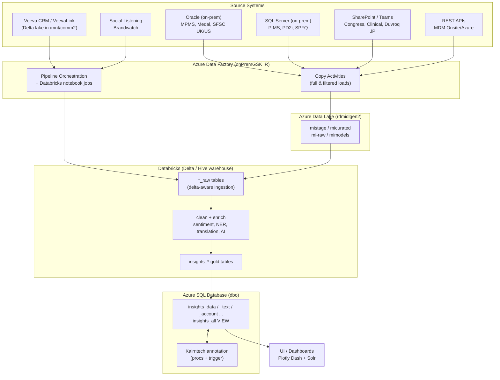

# PART 1 - AIM Plus Agentic — Summary

This document is a consolidated guide to the GenAI V2 backend. The [documentation index](00_INDEX.md) links to the individual deep dives; this page focuses on how the service fits together and the details most useful when developing, debugging, or operating it.

## What the service does

The backend is an asynchronous FastAPI service for pharmaceutical and medical-insights questions. A request can use either private enterprise data or live web information. LangGraph orchestrates the work, specialized agents use retrieval and LLM tools, and SQL Server stores conversation threads, turns, and rolling summaries.

The main routes are:

- `POST /api/aim-service/genai-backend/v2/predict` — non-streaming prediction.
- `POST /api/aim-service/genai-backend/v2/predict/stream` — Server-Sent Events (SSE) progress and answer tokens.
- `POST /filter` — structured-filter search used to preview or prefetch documents.
- `GET /`, `/health`, `/ready`, and `/docs` — service metadata, health/readiness, and Swagger UI.

## Request lifecycle

Each prediction receives a thread ID (`ParentConversationId`) and a per-turn ID (`ConversationId`); both must be GUIDs for SQL Server. The service stores the incoming turn as `processing`, loads eligible prior turns and any summary, runs the graph, then saves the answer or error. Follow-up turns are sequenced within the thread. The thread's `isWebSearch` value is read from SQL, so the selected pipeline remains sticky across turns.

The graph's shared `GraphState` carries request data, routing flags, history, results, and errors. Large DataFrames stay in a session-scoped `DataContext`; the graph state carries reference handles to them instead.

### Internal-data path

1. Query processing uses Azure OpenAI to assess clarity, rewrite the question using context, and decompose it into sub-queries tagged with an intent and data-source type.
2. A clarification can be returned directly. Otherwise, the history checker tries a fuzzy cache match, then asks an LLM whether a simple question can be answered from the thread's history.
3. The supervisor processes each sub-query in turn. Azure AI Search retrieves structured `OTHER` records and/or unstructured `MUN` and `ADB` documents, limited by the selected context IDs. A structured filter request can provide prefetched rows and skip the structured search call.
4. The QA, summary, trends, or analytical agent invokes the matching RAG tools. RAG formats and deduplicates records, chunks them, maps over chunks, and reduces the results while retaining source citations.
5. The combine node joins a single result directly or synthesizes multiple/analytical results with source headers and citations preserved.

### Web-search path

The web agent uses Gemini with Google Search grounding. On follow-ups it can rewrite the question from conversation context, validates medical/pharma relevance, and applies only the optional `Date` filter. Gemini returns answer text and grounding metadata, which is formatted into inline citations and a Sources list. Exact-repeat cache hits and history-answerable follow-ups can avoid a new grounded search.

## Models, retrieval, and memory

- **Azure OpenAI (`gpt-4o`)** handles internal query processing, tool use, history judgments, synthesis, and some RAG tasks. Azure OpenAI authorization uses cached, proactively refreshed OAuth bearer tokens.
- **Google Gemini** handles grounded web search, web-history judgments, and selected large-context RAG tasks.
- **Azure AI Search** provides hybrid keyword/vector retrieval for the internal path. `contextIdList` determines which selected records or indexes are searched; structured filters may use the bundled filter wrapper to prefetch records.
- **Conversation memory** is stored in `gen_query_new` (thread), `gen_query_conversations` (one row per question/answer turn), and `gen_query_summaries` (rolling summary). Completed, non-error turns are eligible for history; cancelled and failed turns are excluded.
- **Caching** is scoped to the loaded thread history. Internal requests use RapidFuzz similarity (threshold 0.85); web requests require an exact normalized query match because web information changes over time. A separate history judge may answer follow-ups from earlier context.
- **Summarization** bounds long conversations using an approximate character-based token count. When the documented threshold is exceeded (about 80,000 tokens), older messages are compressed and the most recent three turns are retained alongside the summary.

## Streaming, errors, and concurrency

Streaming sends `metadata`, `status`, and `token` events, followed by completion. If a client disconnects, the graph task is cancelled to stop ongoing model work, and an independent cleanup updates the turn to `cancelled` so it is not loaded into future history.

Known and unexpected failures are normalized to error codes and safe user-facing messages. The error path still persists the turn and its error details. LLM calls use retry/backoff behavior, including provider rate-limit guidance; SQL writes retry transient stale-connection errors. A shared per-pod semaphore limits LLM calls to 20 concurrent requests, and RAG fan-out defaults to 2. The Azure Storage Queue manager is optional load-leveling infrastructure; the primary prediction routes invoke the graph directly.

## Configuration and operations

Configuration resolves from existing environment variables first, then Key Vault for missing mapped secrets, then code defaults. The Key Vault loader maps 13 required secrets, including AI Search, Azure OpenAI, Gemini endpoints, and SQL credentials. When configured, a Key Vault load failure aborts application startup. In AKS, prefer managed/workload identity; local development can supply values through ignored environment files.

Run the application from the `GenAI/` directory because prompt YAML paths are relative to the working directory. The documented Docker flow builds the V2 image for `linux/amd64`, injects `docker.env` at runtime, and maps a host port to container port 8000. Access to private SQL, AI Search, and model endpoints requires the corporate VPN for local end-to-end predictions. Kubernetes startup, readiness, and liveness probes use the health endpoints.

Logs are emitted to console and rotating files with thread and turn IDs. Use those IDs and `execution_path` to reconstruct a request's route and locate the underlying exception when the API reports a generic error.

## Important caveats and improvement areas

- The documented JWT handling decodes the bearer token and reads its `sub` claim without verifying the signature. This is a security gap that should be addressed before relying on the token for trusted identity.
- Gemini safety categories are documented as disabled; the architecture docs also identify missing content-safety screening, PII protection, and jailbreak defenses.
- Health checks verify configuration rather than proving every dependency is reachable. `/health` checks critical OpenAI and AI Search settings; `/ready` additionally checks index configuration.
- Token estimates for conversation memory are approximate, and caching is limited to the current thread. Evaluation/groundedness scoring, distributed tracing, adaptive quota-aware throttling, and consistent response/citation schemas are identified as areas to improve.
- The SQL `Role` column and legacy `save_conversation` path do not describe the active V2 turn shape; active turns store both query and answer in one row.

## Deep-dive guide

- **Architecture and request paths:** [Architecture](01_CHAT_BOT_ARCHITECTURE.md), [internal workflow](02_INTERNAL_WORKFLOW.md), [web workflow](03_WEB_SEARCH_WORKFLOW.md), [query processing](04_QUERY_PROCESSING.md), [supervisor](05_SUPERVISOR_ORCHESTRATION.md), [specialized agents](06_SPECIALIZED_AGENTS.md).
- **Memory and grounding:** [history and caching](07_HISTORY_AND_CACHING.md), [AI Search retrieval](08_AI_SEARCH_RETRIEVAL.md), [RAG generation](09_RAG_GENERATION.md), [filter API](10_FILTER_API.md), [SQL data flow](18_DATA_FLOW.md), [graph state](17_GRAPH_STATE.md).
- **Models and runtime behavior:** [LLM models](11_LLM_MODELS.md), [token management](12_TOKEN_MANAGEMENT.md), [prompts](13_PROMPTS.md), [streaming](14_STREAMING.md), [error handling](15_ERROR_HANDLING.md), [concurrency and queueing](16_CONCURRENCY_AND_QUEUEING.md).


# PART 2 - AIM Plus Data+RAG Pipeline

Comprehensive catalog of the AIM-DataProcessing platform: sources, targets, loading modes,
update frequency, and the objects that make up each layer (Azure Data Factory, Databricks,
Azure SQL). This is the single reference for "where does this data come from and where does it go".

> **Platform in one line:** On-prem/SaaS sources → Azure Data Factory (copy/orchestration) →
> Azure Data Lake (staging) → Databricks (delta ingestion + enrichment + AI) →
> Azure SQL `insights_*` tables → `insights_all` view → UI/Dashboards (Plotly Dash / Solr).

---

## 1. End-to-End Architecture



**Layered flow:**

`On-prem/SaaS sources → ADF copy → Data Lake (stage) → Databricks raw (delta-aware) → clean/enrich/AI → Databricks gold (insights_*) → Azure SQL → insights_all view → UI`

---

## 2. Source Systems (ADF Linked Services)

| System | Linked Service | Type | Connectivity | What it provides |
|---|---|---|---|---|
| Medical Product Master (MPMS) | `Medical_Product_Data_Source` | Oracle | onPremGSK IR | Medical products, country codes |
| Medal | `Medal_Data_source` | Oracle | onPremGSK IR | Medical access/education data |
| SFSC UK | `SFSC_UK` | Oracle | onPremGSK IR | Salesforce Service Cloud cases (UK) |
| SFSC US | `SFSC_US` | Oracle | onPremGSK IR | Salesforce Service Cloud cases (US) |
| PIMS Market Research | `PIMS_Market_Research` | SQL Server | onPremGSK IR | Market research activity & views |
| PD2i Phase 2 | `PD2i_OnPrem_MSSQL` | SQL Server | onPremGSK IR | PED report metadata |
| SPFQ Dev | `SPFQ_Dev` | SQL Server | onPremGSK IR | SPFQ development data |
| MDM (Master Data Mgmt) | `MDM Rest Onsite`, `MDM Rest Azure` | REST | HTTP | Region mapping, medical conditions, countries, clinical studies |
| SharePoint (modern-ccse) | `SharePointOnlineList1` | SharePoint | myconnect.gsk.com | Clinical & user lists |
| Congress | `CongressList` | HTTP | myteams.gsk.com | Congress/conference files |
| Duvroq (Japan mVoC) | `DuvroqSharepoint` | SharePoint | myteams.gsk.com | Japan mVoC Excel files |
| Azure SQL (Test/UAT/Prod) | `AzureSqlDatabaseTest/UAT/Prod` | Azure SQL | Managed | Application DB (targets) |
| Data Lake | `AzureDataLakeStorage1` | ADLS Gen2 | `rdmidlgen2.dfs.core.windows.net` | Staging/curated storage |
| Databricks (main) | `AzureDatabricksDF` | Databricks | cluster `1021-185207-geek339` | Core ETL |
| Databricks (GPU) | `AzureDatabricksGpuCluster` | Databricks | cluster `1116-105631-mepd2ap2` | ML/NLP (sentiment, classification) |
| Databricks (LLM) | `AzureDatabricksLLM` | Databricks | cluster `1108-065343-9uommzmq` | OpenAI token refresh |
| Key Vault | `AzureKeyVault1` | Key Vault | Managed | All secrets/connection strings/tokens |

**Integration Runtime:** `onPremGSK` bridges all 4 Oracle + 3 SQL Server on-prem sources; credentials in `AzureKeyVault1`.

---

## 3. Schedule / Update Frequency (ADF Triggers)

> All triggers are currently **Stopped** in source control (enabled per-environment at deploy time).

| Trigger | Pipeline | Frequency | Time |
|---|---|---|---|
| Fetch Medal Data | Medal Data | Daily | 20:00 UTC |
| Deltas Insights Run | Deltas Insights Generator | Weekly (Mon–Fri) | 08:30 IST |
| IQI Daily recalculation | IQI Calculation | Daily | 08:00 IST |
| Ingest_VeevaLink__weekly_run | Ingest VeevaLink | Weekly (Sun) | 10:00 IST |
| CleanUp__weekly_run | Periodic Cleanup | Weekly (Sun) | 14:00 IST |
| NER Master File Backup | NER Master File Backup | Weekly (Tue) | 18:00 IST |
| QC metric | QC_metrics | Weekly (Mon, Wed) | 08:00 IST |
| Gen AI Token refresh | Regenerate Open AI API Token | Every 16 hours | Tumbling window |
| Regenerate Open AI API Token | Regenerate Open AI API Token | Hourly recurrence | — |
| Ingest_Congress_Beta__Weekly_run | Ingest Congress | Weekly (Sun) | 09:00 IST |
| Update VeevaCRM Folder Structure | (folder maintenance) | Weekly (Sun–Thu) | 22:00 IST |
| refresh brandwatch | Social Listening Extraction | Daily | 16:00 UTC |
| Bulk GLP Run | (bulk GLP) | Every 14 days | 18:00 IST |
| Fetch Key Message Data | Fetch Key Message Data | Bi-weekly | — |
| Fetch SFSC Data (Deprecated) | Get SFSC Data | Daily | 22:00 UTC |
| Bulk Insights Run (Don't run) | (bulk insights) | Monthly (last day) | 23:59 UTC |

---

## 4. Ingestion & Processing Pipelines (ADF)

| # | Pipeline | Source | Target | Load Mode |
|---|---|---|---|---|
| 1 | Medal Data | Oracle (Medal) | Data Lake `micurated/mpms` | Full refresh |
| 2 | Ingest Congress | SharePoint (HTTP/OAuth) | Data Lake | Binary copy (ForEach) |
| 3 | Get SFSC Data *(deprecated)* | Oracle SFSC UK/US | Data Lake `mistage` | Full load, filtered SQL join |
| 4 | Ingest VeevaLink | VeevaLink | Databricks Hive tables | Notebook ingestion |
| 5 | Periodic Cleanup | Azure SQL / Databricks | Azure SQL | Cleanup & archival |
| 6 | Deltas Insights Generator | VeevaLink/CRM | Azure SQL + Data Lake | Incremental (watermark) |
| 7 | Deltas Get CRM Data | VeevaLink CRM | Databricks delta tables | Delta/incremental (15+ notebooks) |
| 8 | PIMS_MarketResearch_Data_Ingestion | SQL Server (PIMS) | Data Lake (ORC) | Full load (3 copies) |
| 9 | Get Clinical VOC | Clinical DB | Databricks delta | Incremental |
| 10 | Fetch PD2i Phase 2 Source data | SQL Server (PD2i) | Data Lake | Full load |
| 11 | Deltas Insights Processor | Databricks delta | Azure SQL + Databricks | Enrichment (translate, sentiment, classify, KM) |
| 12 | Refresh UI Data | Databricks insights | Solr / UI backend | Refresh (GPU cluster) |
| 13 | NER Master File Backup | Databricks | Backup storage | Full backup |
| 14 | IQI Calculation | Databricks | Azure SQL | Daily calculation |
| 15 | QC_metrics | Databricks | (reports/alerts) | QC analysis |
| 16 | Clean Accounts table | Azure SQL `insights_account` | Azure SQL | Delete/update |
| 17 | Social Listening Extraction | Brandwatch/Social | Databricks delta | Incremental (append) |
| 18 | Regenerate Open AI API Token | — | Key Vault secret | Token rotation |
| 19 | CRM Account | VeevaLink | Databricks | Incremental delta |
| 20 | Refresh Priority Products | Databricks | Databricks | Refresh |
| 21 | Clean Data MIQ | VeevaLink MIQ | Databricks delta | Incremental clean (+ China) |
| 22 | Clean Data SS | Supported Studies | Databricks delta | Incremental (+ China, ViiV, PIMS) |
| 23 | Clean Data Patients MIQ | Patients MIQ | Databricks delta | Incremental clean (+ China) |
| 24 | Raw To Insights | Databricks raw | Azure SQL `insights_*` | Transform/load |
| 25 | Aspect Based Sentiment Analysis | Databricks MVoC | Databricks delta | AI (OpenAI) |
| 26 | Ingest Japan Duvroq | SharePoint (Excel) | Data Lake | Full, XLSX→CSV |
| 27 | CRM Data Japan MIQ | VeevaLink Japan | Databricks delta | Incremental clean |
| 28 | Japan CRM | VeevaLink Japan | Databricks delta | Parallel load |
| 29 | Ingest Clinical 2 | SharePoint Lists | Data Lake | Full load |
| 30 | Archive old versions | Azure SQL `insights_*` | Archive storage | Full archival |
| 31 | Create Mount Points | — | Databricks mounts | Setup only |
| 32 | MDM Data Load - REST - Onsite | REST (MDM) | Azure SQL `mdm_stage_*` | Full load (TRUNCATE + insert) |
| 33 | Remove Deleted Records | Azure SQL `insights_*` | Archive + tracking | Delete archival |
| 34 | Clean Database and Deltas Insights Generator | (composite) | (composite) | Orchestration wrapper |

**Orchestration chain:** `Deltas Insights Generator → Deltas Insights Processor → Refresh UI Data`
(sequential via ExecutePipeline). Failures notify `md2i-aim-de-notifications@gsk.com` via Logic App.

---

## 5. Data Lake Storage Layout (ADLS Gen2 `rdmidlgen2`)

| File system / path | Layer | Content |
|---|---|---|
| `micurated/mpms/` | Curated | `countrycodes.csv`, `medicalproduct.csv` (from Medal/MPMS) |
| `mistage/Duvroq/` | Stage | `Duvroq.csv` (Japan mVoC) |
| `mistage/Clinical/`, `mistage/Clinical_Users/` | Stage | SharePoint clinical + user lists |
| `mistage/congress/`, `mistage/Publications/`, `mistage/document_ingestion_aim/mun/` | Stage | Congress, publications, MUN reports |
| `mi-raw/` | Raw | Raw ingestion landing |
| `mimodels/` | Models | ML/NLP model artifacts (NER, etc.) |

**Databricks mount points (CRM delta source):**

| Mount | Content |
|---|---|
| `/mnt/comm2/{ViiV,Pharma,Common}/Global/{Commercial,Medical}/CRM/Veeva CRM/` | Veeva CRM objects (MVOC, MIQ, KM, Accounts) |
| `/mnt/comm2/Pharma/Global/Common/CRM/SFCC/Case/region=*` | Salesforce cases (NA/EU/APAC) → MIQ / Patient MIQ |
| `/mnt/comm2/Pharma/Global/Medical/Research/IdeaPoint/Submission_Details/` | Supported studies submissions |
| `/mnt/comm2/Common/Local/Japan/CRM/Veeva CRM/` | Japan regional CRM |
| `/mnt/China2/Pharma/Local/China/Medical/CRM/` | China regional CRM |
| `/mnt/mistage/`, `/mnt/veevalink/` | Staging + Veeva Link reference mappings |

---

## 6. Databricks Domains — Sources, Targets & Load Modes

Core pattern is **delta-aware full overwrite**: read `deltas_current` → read CRM delta → exclude
already-ingested rows via `left_anti` join → `write.mode("overwrite")` partitioned by CountryCode →
register Hive table → `INSERT INTO insights_*`. **No `MERGE INTO` is used.**

| Domain | Source | Raw target | Gold target | Load mode | Source code |
|---|---|---|---|---|---|
| MVOC (Medical Voice of Customer) | `Medical_Insight_vod__c`, `Call2_vod__c` | `vcrm_mvoc_raw` | insights_data/account/text | Delta-aware overwrite | 1, 22, 29 |
| MIQ (Medical Inquiry) | SFCC `Case/region=*`, `Medical_Inquiry_vod__c` | `sfsc_miq_raw` | insights_data/account/text | Delta-aware overwrite | 2, 24 |
| MICA (Multichannel Activity) | `Multichannel_Activity_vod__c` | `multichannel_activity` | insights_data/account | Full overwrite | — |
| Clinical VOC | JDBC `insights_data` + `/mnt/ClinicalVOC/` CSV | `vcrm_clinical_voc_raw` | insights_text | Full overwrite | — |
| Key Message (KM) | `Call2_Key_Message_vod__c`, `Key_Message_vod__c` | `km_mvoc_mapped_output` | insights_key_message | Full overwrite (+ `KM_delta`) | — |
| Patient MIQ | SFCC `Case/` CSV regions | `patients_miq_raw` | insights_data/account/text | Delta-aware overwrite | 24 |
| Supported Studies | `IdeaPoint/Submission_Details/` | `vcrm_ss_raw` | insights_data/account/text | Delta-aware overwrite | — |
| Congress | `/mnt/mistage/congress/` Excel/CSV | `congress_raw` | insights_data/text | Full overwrite | 14 |
| Publications | `/mnt/mistage/Publications/raw/` pickle | `publications_raw` | insights_data/text | Full overwrite | — |
| MUN Reports | `/mnt/mistage/.../mun/` PDFs | `mun_reports_raw` | insights_data/text | Full overwrite | 30 |
| Adboards | Veeva CRM Adboards objects | `adboards_raw` | insights_data/text | Full overwrite | 31 |
| PD2i | `PD2i_PED_ReportMetadata.csv` | `PED_ReportMetadata_raw` | insights_data | Full overwrite | — |
| PIMS Market Research | `/mnt/.../PIMS_MarketResearch_Inputs/` ORC | `pims_mrkt_raw` | insights_data/text/products | Full overwrite | 27 |
| Survey | `Survey_vod__c`, `Question_Response_vod__c` | `survey_response` | insights_data/text | Delta-aware overwrite | 4 |
| Social Listening | JDBC `SL_file`, `sl_data_cleaned` | `sl_data_cleaned` | insights_data/text/products | Append (INSERT INTO) | — |
| China / Japan variants | `/mnt/China2/`, `/mnt/.../Japan/` | `*_china`, `*_japan` | regional suffixed | Full overwrite | — |
| Deleted Records | JDBC `insights_*` + deletion files | `*_del_remove` | Azure SQL | Full overwrite (`left_anti`) | — |
| Product / Country | CSV/Delta product & country codes | — | insights_products, mpms_country_codes | Overwrite (saveAsTable) | — |
| Sentiment / NER | insights_text, insights_ners_cleaned | insights_azh_ners_raw | insights_feeling | Overwrite + append | — |
| Logging | Ad-hoc events | — | `md2i_log_delta2` | Append (INSERT INTO) | — |

**Load-mode distribution:** ~80% full overwrite, ~15% delta-aware overwrite, ~5% append. No MERGE.

**Processing/tracking tables (Hive):** `deltas_current` (SourceId, Region, Source, CountryCode),
`deltas_recent`, `md2i_log_delta2` (audit log, append).

**Three clusters by workload:** `AzureDatabricksDF` (ETL) · `AzureDatabricksGpuCluster`
(sentiment/topic/aspect classification) · `AzureDatabricksLLM` (OpenAI token refresh, every 16h).

---

## 7. Azure SQL Database (`dbo`) — AIM Application Schema

Backend for the AIM (Annotation Intelligence Management) app: stores insights, drives the
Kairntech AI annotation loop, and serves the `insights_all` analytics view.

### 7.1 Fact & content tables

| Table | Key columns | Purpose |
|---|---|---|
| `insights_data` | Id (PK), Date, CreatedDate, CountryCode, Name, Role, CollectorName, CollectorType, Status, Source, SourceId, InsertTimeStamp | Core HCP interaction records (fact) |
| `insights_text` | Id (PK), Text_en, Summary_en, Summary, LangCode, Sentiment, Sentiment_en, mvoc_context | Text content, multilingual, sentiment |
| `insights_account` | Id (PK), Name, AccountType, HCPType, HCPId, Specialty1/2, SpecialtyCluster, ExpertiseArea/Level, City, State, Zip, Lat/Long | HCP/account profile |
| `insights_products` | Id (PK), Product, Therapy_area, Indication | Product hierarchy mapping |
| `insights_additional` | Id (PK), Question(_en), ContentIds, ContentTitles(_en), VerbalResponse(_en) | Supplementary Q&A / references |
| `insights_meetings` | Id (PK), MeetingText, Link, ParticipatingCountries | Meeting/event insights |
| `insights_clinical` | Id (PK), StudyId | Clinical study associations |
| `insights_mvoc_quality` | Id (PK), overallScore, who/what/why/soWhat/succinctScore | mVoC quality scoring |
| `insights_documents` | Id (PK), Document_link, study_type | Document references |
| `insights_social_listening` | Id (PK), PageType, ReachEstimate, Impact, LinkAddress | Social listening insights |
| `insights_key_message` | CallKeyMessageID, CallId, KeyMessageText, Date | Sales-call key messages |

### 7.2 Annotation / labeling

| Table | Key columns | Purpose |
|---|---|---|
| `insights_label_new` | AimId (FK), LabelItemId (FK), Status, start, end | Labels applied to text spans (approved/rejected/pending) |
| `label_item` | LabelItemId (PK), LabelText, LabelCategoryID (FK) | Master label values |
| `label_category` | LabelCategoryID (PK), type | Label categories (by product) |
| `Kairntech_projects` | project_name (PK), product, model_yn, Id | Kairntech project ↔ product mapping |
| `Kairntech_send_log` | trigger_time, id (AimId), sent_message | Audit of docs sent to Kairntech |

### 7.3 Reference & config

| Table | Key columns | Purpose |
|---|---|---|
| `data_sources` | Id (PK), Name | Source-type reference |
| `mpms_country_codes` | CTRY_CD (PK), CTRY_NM | Country lookup |
| `HCPType_mapping` | HCPType, HCPType_clustered | HCP type normalization |
| `se_product_hcp_mapping` | aim_product_name, Id (HCPId), focus_decile | Product↔HCP affinity |
| `se_indication_hcp_mapping` | aim_indication_name, Id (HCPId), focus_decile | Indication↔HCP affinity |
| `veeva_link` | X_VEEVA_ID, MPMS_TA, X_EE_HCP_VL_Link | Veeva CRM link |
| `PriorityProductView` | AlternateTerm, OfficialName | Product name normalization |
| `application_config_detail` | Property (PK), value | Config KV (API endpoints, tokens) |
| `oldver_insights_data` | SourceId, Source | Archived insights_data |
| `mdm_stage_region_mapping` / `mdm_stage_medical_condition` / MDM stage tables | — | MDM REST landing (TRUNCATE+insert) |

### 7.4 View, procedures, trigger

| Object | Type | Purpose |
|---|---|---|
| `insights_all` | View | Denormalized 360° analytics view joining 14+ tables + CTEs; filters 'misdirected'; feeds dashboards |
| `API_generate_doc` | Function | Builds JSON export for one AimId (text, summary, approved/rejected labels) |
| `API_get_projects` | Procedure | Syncs Kairntech projects (TRUNCATE + INSERT `Kairntech_projects`) |
| `API_post_add_document` | Procedure | Imports one insight's document into Kairntech pipelines |
| `API_post_annotate_item` | Procedure | Calls Kairntech annotate API for one record; returns labels/phrases |
| `API_post_annotate_items_multi` | Procedure | Batch annotate; inserts labels with score > 0.5 into `insights_label_new` |
| `AfterLabelTrigger` | Trigger (`insights_label_new`) | On INSERT/UPDATE/DELETE: logs to `Kairntech_send_log`, calls `API_post_add_document` |

### 7.5 SQL relationships

```
insights_data (fact)
 ├─1:1→ insights_text, insights_account, insights_additional, insights_meetings,
 │      insights_clinical, insights_mvoc_quality, insights_documents, insights_social_listening
 ├─N:1→ data_sources
 └─N:1→ insights_products ─N:1→ PriorityProductView

insights_account ─N:1→ mpms_country_codes, HCPType_mapping, veeva_link
                 └─N:M→ se_product_hcp_mapping, se_indication_hcp_mapping

insights_label_new ─N:1→ insights_data (AimId), label_item ─1:N→ label_category
```

**External integration:** Kairntech ML annotator (NLP categorization / entity tagging) via
`application_config_detail` endpoints (`CODING_API_ENDPOINT`, `CODING_API_PROJECT_EXTENTION`, `PIMS_TOKEN`).

### 7.6 Automated analysis (intelligent reports) run logs

Execution audit for the **automated "intelligent reports" generation** pipeline that produces the
AI analysis served to the UI (backend `GET aimbackendservice/reports/get-intelligent-reports-data`).
One row is written **per product × run_month × data_source × step**; the UI reads these to show
report availability/freshness and per-step run status. Same column set in both tables (`log_id`
`IDENTITY` PK; `run_month`, `product_name`, `data_source`, `step`, `status` NOT NULL; nullable
`start_time`, `end_time`, `error_message`; `created_at` NOT NULL).

| Table | Rows | run_month range | data_source | Purpose |
|---|---|---|---|---|
| `Automated_analysis_execution_production_log` | ~1,512 | 2025-09 → 2026-08 | `SL`, `SL_Excluded` | Live/production run log the UI reads |
| `Automated_analysis_execution_log` | ~216 | 2025-09 → 2025-11 | `SL_Excluded` | Dev/test run log (older, single source) |

**Pipeline steps** (per product/month, in order): `data_retrieval` → `sentiment_retrieval` →
`generation` → `data_saving`. `status` observed = `success` (schema also carries `error_message`
for failures). Covers ~18 products; `data_source` distinguishes runs including vs excluding Social
Listening (`SL` / `SL_Excluded`).

> **Generator location:** neither this workspace nor `aimbackendservice` writes these logs.
> `aimbackendservice` only **reads** the report tables (its `ReportingService`). The component that
> runs these steps and populates the tables is a separate generator (location not yet identified).

### 7.7 Automated intelligent reporting — precomputed report content

Seven `Automated_Intelligent_Reporting_Cluster{1..7}` tables hold the **precomputed, AI-generated
content served to the UI intelligent-reports dashboard** (via `get-intelligent-reports-data`). Each
"cluster" table = one report section; the run logs in §7.6 track the pipeline that populates them.
**Grain:** one row per `TimePeriod × Product × DataSource × (ClusterName / SSO / theme / gap)`.
**Coverage observed:** `TimePeriod` 202507 → 202607, ~18 products, both `SL`/`SL_Excluded`.

The first four columns are common: `TimePeriod` int (`YYYYMM`, e.g. `202607`), `Product` varchar,
`DataSource` varchar (`SL` = Social Listening, `SL_Excluded` = mVoC), `ClusterName`. **Beyond that
the seven tables do NOT share a schema** — only Cluster1 carries the JSON `Data` + LLM `DataSummary`;
the others are structured (theme/gap rows with counts):

| Table | Rows | Section theme | Distinct columns (beyond TimePeriod/Product/DataSource/ClusterName) |
|---|---|---|---|
| `..._Cluster1` | ~5.4K | Volume & sentiment trends (all time-series charts) | `Data` (JSON), `DataSummary` (LLM narrative) |
| `..._Cluster2` | ~6.7K | Themes by country | `ThemeName`, `Description`, `SupportingDocCount`, `TotalDocCount` |
| `..._Cluster3` | ~13.9K | Most Stated Positives/Negatives | `ThemeName`, `Description`, `SupportingDocsMentioned`, `PriorMonthChange`, `SupportingDocCount`, `TotalDocCount` |
| `..._Cluster4` | ~7.9K | Data Gaps/Needs | `GapName`, `Description`, `SupportingDocsMentioned`, `SupportingDocCount`, `TotalDocCount` |
| `..._Cluster5` | ~7.6K | Education Gaps/Needs | `GapName`, `Description`, `SupportingDocsMentioned`, `SupportingDocCount`, `TotalDocCount` |
| `..._Cluster6` | ~7.2K | Competitor sentiment | `ThemeName`, `Description`, `PriorMonthChange`, `SupportingDocCount`, `TotalDocCount` |
| `..._Cluster7` | ~16.2K | Impact aligned to SSO (drivers/barriers) | `SSO`, `ThemeName`, `Description`, `SupportingDocCount`, `TotalDocCount` |

`SSO` = Strategic Scientific Objective. In Cluster1, `Data` drives the chart and `DataSummary` is the
AI commentary; `ClusterName` selects the specific chart (e.g. `DATA VOLUME BY SENTIMENT OVER TIME`,
`DATA VOLUME BY SSO OVER TIME`, `VOLUME BY SENTIMENT FOR SSO1..4 OVER TIME`, `Competitor Sentiment
Over Time`, `COMMON DATA/EDUCATION NEEDS/GAPS OVER TIME`).

**How the UI reads them (`aimbackendservice/AIMServices/ReportingService`).** The GET endpoint takes
`VisualTab, gsk_mudid, ReportType (=DataSource), TimePeriod, Product`. `ReportingService` maps each
`VisualTab` to one or more cluster queries in `Repository/GetIntelligentReportRepo.py`:

| `VisualTab` | Cluster tables read | Notes |
|---|---|---|
| `data_behind_Insights` | C1 | `DATA VOLUME BY SOURCE/COUNTRY/SPECIALTIES OVER TIME` |
| `themes_by_country` | C2 | single `TimePeriod` |
| `global_sentiment` | C1 + C3 | C1 `DATA VOLUME BY SENTIMENT OVER TIME` + C3 pos/neg summaries |
| `most_stated_positives_challenge_barriers` | C3 | — |
| `data_gaps_needs_by_ees` | C4 + C1 | C1 `COMMON DATA NEEDS/GAPS OVER TIME` |
| `education_gaps_needs_by_ees` | C5 + C1 | C1 `COMMON EDUCATION NEEDS/GAPS OVER TIME` |
| `sentiment_from_ees_engaged` | C1 + C6 | C1 `Competitor Sentiment Over Time` |
| `sso` | C1 | `DATA VOLUME BY SSO OVER TIME` |
| `impact_aligned_to_sso` | C1 + C7 + `PriorityProducts_SSO_Mapping` | C1 `VOLUME BY SENTIMENT FOR SSO% OVER TIME` / `SENTIMENT FOR SSO% BY COUNTRY` |

> **The read layer is hard-wired to monthly.** Trend queries build a rolling **12-month** window from
> `GETUTCDATE()` via `DATEADD(MONTH, -n, …)`, parse `TimePeriod` as a date using `LEFT(TimePeriod,4)`
> (year) + `RIGHT(TimePeriod,2)` (month), exclude the current month, and Cluster3/6 carry a baked-in
> `PriorMonthChange`. Any quarterly cadence must change both the generator **and** this read layer
> (see §7.8).

### 7.8 Quarterly cadence — design notes (not yet implemented)

Requirement: UI adds a **Monthly / Quarterly** toggle (M1, M2 … / Q1–Q4). The reports are precomputed
monthly, so quarterly needs new **precomputed quarter rows** — you cannot relabel months. Three
changes are required:

1. **Generator (find it first).** Produce quarter-grain rows for all 7 tables over a 3-month window:
   - **Cluster1** (numeric/JSON): sum `Data Volume` across the quarter per series; **recompute**
     `Data Percentage` from summed volumes (do NOT average monthly %); regenerate `DataSummary` as a
     quarter narrative.
   - **Cluster2–7** (theme/gap/LLM): re-run extraction/LLM over the quarter's pooled documents to get
     `ThemeName`/`GapName`/`Description`/`SupportingDocCount`/`TotalDocCount`; recompute
     `PriorMonthChange` as prior-**quarter** change. Do not stitch monthly rows — regenerate.
2. **`TimePeriod` encoding.** Because read SQL does `RIGHT(TimePeriod,2)` = month, keep `YYYYMM` using
   the quarter's **last month** (Q1 2026 → `202603`) and add a **`Cadence`** column (`'M'`/`'Q'`) to
   disambiguate. Avoid a `YYYYQ` scheme — it breaks the existing date math.
3. **ReportingService read layer.** Add quarter-aware query variants (the current ones hardcode the
   monthly rolling window and `PriorMonthChange`) and surface quarter options in
   `GetIntelligentReportsFilterRepo.py`. The UI toggle drives a `Cadence`/`TimePeriod` param these
   queries honour.

---

## 8. Loading-Mode & Frequency Conventions

| Concern | Convention |
|---|---|
| Full load | ADF copy with `preCopyScript` TRUNCATE (MDM), or Databricks `mode("overwrite")` |
| Incremental / delta | `deltas_current` watermark + `left_anti` join (Databricks); watermark last-ID (ADF) |
| Append | Audit/log (`md2i_log_delta2`) and some Social Listening flows only |
| Merge/upsert | Not used anywhere |
| Partitioning | `insights_*` tables partitioned by `CountryCode` |
| Regional variants | `_japan` / `_china` suffixed tables & `.../japan/`, `.../china/` notebooks |
| Deletion handling | `DeletedRecords/` notebooks + `Remove Deleted Records` / `Archive old versions` pipelines |
| Secrets | All in `AzureKeyVault1`; on-prem via `onPremGSK` IR |
| Failure alerting | Email `md2i-aim-de-notifications@gsk.com` via Logic App |

**Cadence summary:** daily (Medal, IQI, Brandwatch, SFSC-deprecated) · weekly (Deltas Insights,
VeevaLink, Cleanup, Congress, NER backup, QC) · every 16h (OpenAI token) · bi-weekly (Key Message,
Bulk GLP) · monthly (Bulk Insights).

---

## 9. Source Code Reference (`deltas_current.Source`)

| Code | Domain | Code | Domain |
|---|---|---|---|
| 1 | MVOC | 22 | MVOC (variant) |
| 2 | MIQ | 24 | MIQ / Patient MIQ |
| 4 | Survey | 27 | PIMS Market Research |
| 14 | Congress | 29 | MVOC (variant) |
| 30 | MUN Reports | 31 | Adboards |

> Codes are the integer keys used across `deltas_*` ingestion notebooks to route each domain's records.

---

## 10. Data Science Components

AI/ML enrichment layers that sit on top of the ingestion pipelines. All run on Databricks
(GPU cluster for local models, LLM cluster + Azure OpenAI for GenAI), enrich the `insights_*`
tables, and are orchestrated by the **Deltas Insights Processor** / dedicated ADF pipelines.

| Component | Purpose | Tech / Model | Input → Output |
|---|---|---|---|
| NER (entity extraction) | Tag drugs, studies, conditions in text | Azure Health NER + custom models (`mimodels`) | `insights_text` → `insights_ners_cleaned`, `insights_azh_ners_raw` |
| Aspect-based sentiment | Per-entity sentiment on drug/study mentions | BERT (GPU) + Azure OpenAI GPT‑3.5 | `insights_ners_cleaned` → `insights_sentiment` → `insights_text.Sentiment` |
| Translation | Normalize non-EN text to English | Translator service | source text → `Text_en`, `Summary_en`, `Sentiment_en` |
| Summarization | Short summaries of mVoC text | Azure OpenAI GPT‑3.5 (`summarizedMVOCgpt35turbo`) | `insights_text.Text` → `Summary` |
| Kairntech annotation | NLP categorization / labeling loop | Kairntech REST API | `insights_text` → `insights_label_new` (score > 0.5) |
| IQI (quality scoring) | mVoC quality metrics | Rule/ML scoring | mVoC text → `insights_mvoc_quality` |
| QC metrics | Data quality monitoring/alerts | Databricks analysis | mVoC tables → QC reports/alerts |

### 10.1 Sentiment Classification (detailed)

Located in [Databricks/notebooks/mvoc/sentiment_analysis/](../Databricks/notebooks/mvoc/sentiment_analysis).
Runs as ADF pipeline **"Aspect Based Sentiment Analysis"** and within the Deltas Insights Processor.
This is **aspect-based (entity-level)** sentiment — scored per drug/study entity, not per document.

**Input filter:** NER output table `insights_ners_cleaned`, keeping only entity categories
`Gsk_drug`, `Other_drug`, `Uncategorized_drug`, `gsk_study`, `other_study`.

**Stage 1 — Preprocessing** (`sentiment_preprocessing.py`): NLTK Punkt sentence tokenization,
map each entity to its sentence via token spans, count entities per sentence, then **route**:

| Entities per sentence | Routed to | Model |
|---|---|---|
| exactly 1 | `bert_model_input` | BERT |
| 2–3 distinct | `absa_model_input` | ABSA / Azure OpenAI |
| 0 | `no_sentiment_detection_data` | (none) |
| > 3 | skipped | (no model applied) |

**Stage 2 — Model scoring:**

| Model | Notebook | How |
|---|---|---|
| BERT (single entity) | `sentiment_model_1.py` | Fine-tuned PyTorch BERT via `simpletransformers.ClassificationModel`, loaded from `/dbfs/mnt/models/sentiments/outputs_bert_retrain_pytorch/` on GPU. Classes negative(0)/neutral(1)/positive(2) with softmax Neg/Neu/Pos probabilities. |
| ABSA → Azure OpenAI (multi-entity) | `sentiment_model_absa.py` | Originally `aspect_based_sentiment_analysis` library; active code calls Azure OpenAI GPT‑3.5‑turbo (`summarizedMVOCgpt35turbo`, `temperature=0`) prompting for Positive/Negative/Neutral probabilities per entity summing to 1. |
| Aspect-based OpenAI | `Aspect_Based_Sentiment_Open AI_model.py` | LangChain + Azure OpenAI GPT‑3.5‑turbo per entity, parallelized with Dask; fuzzy-matches OpenAI entity vs. Azure Health NER entity. |

**Stage 3 — Post-processing** (`sentiment_post_processing.py`): concatenates
`bert_model_output` + `absa_model_output` + `no_sentiment_detection_data`, explodes to one row per
entity, attaches entity/sentence char spans, defaults missing to `not_applicable`, writes delta table
**`insights_sentiment`** (Id, CompositKey, TypeNer, TextNer, entityStart/End, sentenceStart/End,
sentimentScore, Sentiment), then pushes to Azure SQL via JDBC → surfaces in `insights_text.Sentiment`
/ `Sentiment_en` and the `insights_all` view.

**Document-level rollup rule:** Positive = ≥1 positive sentence (rest neutral) · Negative = ≥1
negative (rest neutral) · Mixed = at least one positive *and* one negative · Neutral = all neutral.

**Variants:** `One Time ... retro` (historical backfill) and `_bulk` (incremental) versions share the
same logic. Evolution: BERT + library ABSA, later largely superseded by Azure OpenAI GPT‑3.5‑turbo.
GPU cluster runs BERT scoring; OpenAI token refreshed every 16h by the GenAI pipeline.

### 10.2 Model Training vs. Inference

Most models in the pipeline run **inference-only** — pre-fine-tuned artifacts are loaded from DBFS
(`/dbfs/mnt/models/...`), not trained in-repo. The one exception is a deprecated BERT training
notebook retained for the emotion/"Feelings" classifier.

| Model | Mode in repo | Framework / loader | Artifact / script location |
|---|---|---|---|
| Sentiment (3-class: neg/neu/pos) | **Inference only** | `simpletransformers.ClassificationModel('bert', ...)` (PyTorch, GPU) | Loads `/dbfs/mnt/models/sentiments/outputs_bert_retrain_pytorch/` — artifact not in repo |
| Feelings / emotion (9-class) — PyTorch | **Inference only** | `simpletransformers.ClassificationModel('bert', ...)` (PyTorch) | Loads `/dbfs/mnt/models/feelings/outputs_bert_pytorch/` — [insights_feeling_bert.py](../Databricks/notebooks/mvoc/feeling/insights_feeling_bert.py) |
| Feelings / emotion (9-class) — TensorFlow | **Training + inference** (deprecated) | TF `tf.estimator.Estimator` + Google `bert` (`run_classifier`, `optimization`, `tokenization`) | [Bert_Multiclass_Feelings_Training.py](../Databricks/notebooks/-deprecated-/Feelings_Multiclass/Bert_Multiclass_Feelings_Training.py) |
| Topic classification | **Inference only** | `transformers.AutoModelForSequenceClassification` + `AutoTokenizer` | [topic_classification_delta.py](../Databricks/notebooks/mvoc/topicClassification/topic_classification_delta.py) |
| NER (healthcare) | **Inference only** (managed service) | `azure-ai-textanalytics` `TextAnalyticsClient` | [mvoc/ner/azure-healthcare-ner.py](../Databricks/notebooks/mvoc/ner/azure-healthcare-ner.py) |
| NER (biomedical) | **Inference only** (pre-trained) | `scispacy` / `spaCy` (`en_ner_bc5cdr_md`, `en_core_sci_scibert`), `med7` | Social Listening + `mvoc/ner/` notebooks |
| Summarization / aspect sentiment | **Inference only** (API) | Azure OpenAI GPT‑3.5‑turbo via `openai` / `langchain` | `sentiment_analysis/` + GEN_AI notebooks |

**Inference serving characteristics:**
- **Hardware:** local BERT/transformer models run on the Databricks **GPU cluster**
  (`AzureDatabricksGpuCluster`, `use_cuda=True`); OpenAI/NER run via REST on the standard cluster.
- **Batching:** BERT predicts in fixed-size mini-batches (e.g. 40 sentences/loop); OpenAI aspect
  sentiment is parallelized with **Dask** (`ThreadPoolExecutor(16)`); embeddings/NER chunked ~1,000 rows.
- **Load mode:** delta-aware — only new/changed records are scored each run (`_delta` notebooks),
  with `_bulk`/`retro` variants for full backfill.
- **Output:** predictions written to delta tables then pushed to Azure SQL via JDBC
  (`insights_sentiment`, `insights_feeling`, `insights_azh_ners_raw`, `insights_categories`).

**Fine-tuning (training) in-repo:** only the deprecated TensorFlow Feelings notebook —
`BATCH_SIZE=8`, `LEARNING_RATE=2e-5`, `NUM_TRAIN_EPOCHS=5`, `WARMUP_PROPORTION=0.1`, checkpoints every
300 steps; reads labeled `data_feelings.csv`, `LabelEncoder` on emotion labels, `train_test_split`,
saves checkpoints to `OUTPUT_DIR`. The production PyTorch sentiment/feelings BERT models were
fine-tuned outside this repo; only their artifacts (on DBFS) are referenced.


- **Operations:** [configuration and secrets](19_CONFIG_AND_SECRETS.md), [logging and observability](20_LOGGING_OBSERVABILITY.md), [lifecycle and health](21_APP_LIFECYCLE_HEALTH.md), [running in Docker](22_RUNNING_IN_DOCKER.md).
