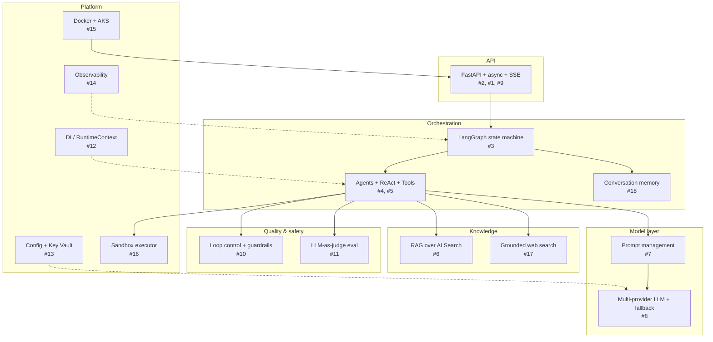

# 99 · Knowledge Base — Core Concepts for Building an App Like Patient+

> A concept-by-concept primer for engineers who want to build a system like Patient+ (a
> streaming, multi-agent, RAG-backed analytics backend). Each concept has: **what it is**, **why it
> matters**, a **repo example**, and **online resources** to go deeper.
>
> Cross-references point to the angle docs in this folder (see [README.md](README.md)).

---

## Table of contents

1. [Async Python & the event loop](#1-async-python--the-event-loop)
2. [FastAPI as an async API layer](#2-fastapi-as-an-async-api-layer)
3. [LangGraph & state-machine orchestration](#3-langgraph--state-machine-orchestration)
4. [Agents & the ReAct pattern](#4-agents--the-react-pattern)
5. [Tools & tool-calling](#5-tools--tool-calling)
6. [Retrieval-Augmented Generation (RAG)](#6-retrieval-augmented-generation-rag)
7. [Prompt management & templating](#7-prompt-management--templating)
8. [Multi-provider LLM abstraction & fallback](#8-multi-provider-llm-abstraction--fallback)
9. [Streaming responses (SSE & token streaming)](#9-streaming-responses-sse--token-streaming)
10. [Loop control & guardrails](#10-loop-control--guardrails)
11. [LLM-as-a-judge evaluation](#11-llm-as-a-judge-evaluation)
12. [Dependency injection & runtime context](#12-dependency-injection--runtime-context)
13. [Configuration & secrets management](#13-configuration--secrets-management)
14. [Observability & structured logging](#14-observability--structured-logging)
15. [Containerisation & Kubernetes deployment](#15-containerisation--kubernetes-deployment)
16. [Sandboxing untrusted / generated code](#16-sandboxing-untrusted--generated-code)
17. [Grounded web search & citations](#17-grounded-web-search--citations)
18. [Conversation memory](#18-conversation-memory)

---

## 1. Async Python & the event loop

**What it is.** `async`/`await` lets a single thread handle many I/O-bound operations (HTTP calls,
DB queries, LLM requests) concurrently by suspending a coroutine while it waits, instead of blocking.
`asyncio.gather` runs coroutines in parallel; `asyncio.Queue` and semaphores coordinate them.

**Why it matters.** An LLM app spends most of its time waiting on network I/O (model APIs,
retrieval, DB). Async lets one process fan out many concurrent model/tool calls without threads,
which is exactly why Patient+ can run web + Glean + insights branches simultaneously.

**Repo example.**
- Every agent/tool/node is `async def` — a hard convention (see
  [.github/copilot-instructions.md](../.github/copilot-instructions.md)).
- `external_path_node` runs web + Glean concurrently with `asyncio.gather`
  ([apps/orchestrator/orchestrator_workflow.py](../apps/orchestrator/orchestrator_workflow.py)).
- A shared LLM semaphore (`LLM_SEMAPHORE` from `constants.LLM_CONCURRENCY_LIMIT()`) caps concurrent
  model calls in `insights_tool`.

**Resources.**
- Python docs — asyncio: https://docs.python.org/3/library/asyncio.html
- Real Python — Async IO in Python: https://realpython.com/async-io-python/
- `asyncio.gather` / semaphores: https://docs.python.org/3/library/asyncio-task.html

---

## 2. FastAPI as an async API layer

**What it is.** FastAPI is an async Python web framework with type-hint-based validation
(Pydantic), dependency injection, and first-class streaming. It uses an ASGI server (uvicorn).

**Why it matters.** It gives you request validation, `StreamingResponse` for SSE, and a `lifespan`
hook to build expensive resources (DB pools, LLM clients) once at startup.

**Repo example.**
- [fastapi_v1.py](../fastapi_v1.py) defines the app, the `/generate` and `/generate-stream`
  endpoints, health probes, and a **lifespan** that loads Key Vault, builds the DB pool + AI Search
  client, and calls `runtime_holder.set_runtime(...)`.
- See [00 · Architecture](00-architecture.md) for the full request flow.

**Resources.**
- FastAPI docs: https://fastapi.tiangolo.com/
- Lifespan events: https://fastapi.tiangolo.com/advanced/events/
- Streaming responses: https://fastapi.tiangolo.com/advanced/custom-response/#streamingresponse
- uvicorn: https://www.uvicorn.org/

---

## 3. LangGraph & state-machine orchestration

**What it is.** LangGraph models an application as a **graph of nodes** operating over a shared
**state** object. Edges (static or conditional) define control flow; **reducers** merge state
updates from parallel branches safely.

**Why it matters.** Multi-agent flows have branching, fan-out/fan-in, and conditional routing.
Hand-rolling that with locks is error-prone. LangGraph makes the topology declarative and handles
parallel state merging for you.

**Repo example.**
- `build_orchestrator_graph()` in
  [apps/orchestrator/orchestrator_workflow.py](../apps/orchestrator/orchestrator_workflow.py) builds
  a `StateGraph(GraphState)` with 8 nodes and 3 conditional routers (`router`, `type_router`,
  `branch_router` — the parallel-join gate).
- **Reducers**: `GraphState` fields use `Annotated[List[...], operator.add]` so parallel branches'
  returns auto-merge ([apps/state/state.py](../apps/state/state.py)).
- Deep-dive: [01 · Harness Engineering](01-harness-engineering.md).

```python
# Pattern used in the repo
from langgraph.graph import StateGraph, END
graph = StateGraph(GraphState)
graph.add_node("query_analyzer", query_analyzer_node)
graph.add_conditional_edges("query_analyzer", type_router,
                            {"analytical": "analytical", "insights": "insights_react"})
compiled = graph.compile()
result = await compiled.ainvoke(initial_state)
```

**Resources.**
- LangGraph docs: https://langchain-ai.github.io/langgraph/
- Low-level `StateGraph` concepts: https://langchain-ai.github.io/langgraph/concepts/low_level/
- State reducers: https://langchain-ai.github.io/langgraph/concepts/low_level/#reducers

---

## 4. Agents & the ReAct pattern

**What it is.** An **agent** is an LLM that decides what to do next (which tool to call) based on
observations. **ReAct** (Reason + Act) interleaves reasoning ("thought"), an action (tool call), and
an observation (tool result), looping until it can answer.

**Why it matters.** It lets one component handle open-ended, multi-step questions without a fixed
script — while a step cap keeps it bounded.

**Repo example.**
- [apps/agents/insights_react_agent.py](../apps/agents/insights_react_agent.py) implements a
  hand-rolled ReAct loop (`MAX_REACT_STEPS = 3`) with a `Scratchpad` for observations and
  `answered_ids` dedup, plus three optimisation paths (fast / uniform-tool / full planner).
- See [00 · Architecture](00-architecture.md) and [02 · Loop Engineering](02-loop-engineering.md).

**Resources.**
- ReAct paper (Yao et al., 2022): https://arxiv.org/abs/2210.03629
- LangGraph prebuilt ReAct agent: https://langchain-ai.github.io/langgraph/reference/agents/
- Prompt Engineering Guide — ReAct: https://www.promptingguide.ai/techniques/react

---

## 5. Tools & tool-calling

**What it is.** A **tool** is a function the agent can invoke (search, SQL, an API, a calculator).
Modern LLMs support structured "function/tool calling" where the model returns a JSON call.

**Why it matters.** Tools ground the LLM in real data and actions instead of relying on parametric
memory.

**Repo example.**
- `insights_tool` (RAG QA + summarisation), `analytical_tool` (stats pipeline), and
  `market_research_tool` (Glean) live under `apps/tools/`; the ReAct planner dispatches to them via
  `_call_tool` in [insights_react_agent.py](../apps/agents/insights_react_agent.py).
- The analytics executor uses a `ToolRegistry` of compute tools (`apps/tools/analytics_tools/`).

**Resources.**
- OpenAI function/tool calling: https://platform.openai.com/docs/guides/function-calling
- Anthropic tool use: https://docs.anthropic.com/en/docs/build-with-claude/tool-use
- LangChain tools concept: https://python.langchain.com/docs/concepts/tools/

---

## 6. Retrieval-Augmented Generation (RAG)

**What it is.** RAG retrieves relevant documents (usually via vector/hybrid search) and feeds them
into the prompt so the LLM answers from your data, with citations, instead of hallucinating.

**Why it matters.** It's the core pattern for question-answering over private corpora — and pairing
it with faithfulness evaluation (concept 11) keeps answers grounded.

**Repo example.**
- [apps/retrieval/ai_search_retrieval.py](../apps/retrieval/ai_search_retrieval.py) (`get_aisearch_data`)
  and the `patientplus_search` package query **Azure AI Search** across multiple indexes
  (`dimensions-index`, `mvoc-index`, `patients-miq-index`, `social-listening-index`).
- `insights_tool` chooses a direct path (<100K tokens) vs map-reduce chunking, then writes an
  **evidence cache** used later for faithfulness checks (see
  [05 · Evaluation Framework](05-evaluation-framework.md)).

**Resources.**
- RAG (original paper, Lewis et al.): https://arxiv.org/abs/2005.11401
- Azure AI Search — RAG overview: https://learn.microsoft.com/en-us/azure/search/retrieval-augmented-generation-overview
- Azure AI Search hybrid/vector search: https://learn.microsoft.com/en-us/azure/search/vector-search-overview

---

## 7. Prompt management & templating

**What it is.** Externalising prompts as versioned templates (YAML/JSON) with variable
interpolation, loaded by name — rather than hardcoding strings in code.

**Why it matters.** Prompts change far more often than logic. Externalising them lets you tune,
review, and A/B prompts (and even switch models per prompt) without redeploying code.

**Repo example.**
- Prompts live under `prompts/agents/`, `prompts/tools/`, `prompts/reflection/` and are loaded via
  `PromptLoader` → `PromptRegistry`, referenced by name (e.g. `react_planner_prompt`,
  `compiler_executive_summary_prompt`).
- Crucially, the **provider is inferred from the folder** (`prompts/**/openai|gemini|claude/`), so
  model choice is a content decision — see [06 · LLM Model Choices](06-llm-model-choices.md).

**Resources.**
- Prompt Engineering Guide: https://www.promptingguide.ai/
- LangChain prompt templates: https://python.langchain.com/docs/concepts/prompt_templates/
- OpenAI prompt engineering: https://platform.openai.com/docs/guides/prompt-engineering

---

## 8. Multi-provider LLM abstraction & fallback

**What it is.** A single interface (`run` / `run_stream`) in front of multiple model providers,
with routing and **fallback** (retry on a different provider when one is rate-limited or errors).

**Why it matters.** Matching provider strengths to tasks (reasoning vs grounding vs long context)
and failing over on 429s gives both quality and resilience.

**Repo example.**
- `LLMFactory` in [linked_services/runtime/llm_factory.py](../linked_services/runtime/llm_factory.py)
  resolves ordered provider configs from the registry, dispatches on `model_params.model`
  (`gemini` / `claude*` / OpenAI), and falls back by `priority` on
  `RETRYABLE_ERRORS = (RateLimitError, aiohttp.ClientError)`.
- Providers: Azure OpenAI GPT-5 family, Gemini (grounded search + long context), Claude Opus 4.6.
  Full detail in [06 · LLM Model Choices](06-llm-model-choices.md).

**Resources.**
- Azure OpenAI docs: https://learn.microsoft.com/en-us/azure/ai-services/openai/
- Google Gemini API: https://ai.google.dev/gemini-api/docs
- Anthropic API: https://docs.anthropic.com/en/api/getting-started
- LangChain fallbacks (alternative pattern): https://python.langchain.com/docs/how_to/fallbacks/

---

## 9. Streaming responses (SSE & token streaming)

**What it is.** **Server-Sent Events (SSE)** stream incremental events over one HTTP connection.
**Token streaming** pushes LLM output token-by-token so users see text as it's generated.

**Why it matters.** Perceived latency drops dramatically — the user sees the first content in
~1 second instead of waiting for the whole answer.

**Repo example.**
- The `/generate-stream` endpoint returns a `StreamingResponse`; `process_endpoint_stream` in
  [fastapi_v1.py](../fastapi_v1.py) uses an `asyncio.Queue` + `stream_callback` + heartbeats.
- **Source-gated streaming**: `source_ready_callback` buffers per source and emits a clean block
  when ready; fast external sources bypass the gate. The compiler streams `summary_chunk` tokens via
  `run_stream` with an `IncrementalMarkdownStreamFormatter`. See
  [00 · Architecture](00-architecture.md) and `apps/orchestrator/stream_progress.py`.

**Resources.**
- MDN — Server-Sent Events: https://developer.mozilla.org/en-US/docs/Web/API/Server-sent_events
- FastAPI streaming: https://fastapi.tiangolo.com/advanced/custom-response/#streamingresponse
- OpenAI streaming: https://platform.openai.com/docs/api-reference/streaming

---

## 10. Loop control & guardrails

**What it is.** Bounding iterative agent loops (max steps, retries, token budgets) and validating
inputs/outputs (scope filtering, PII redaction, content safety).

**Why it matters.** Without caps, agent loops waste money and can spin forever; without guardrails,
they leak PII or answer out-of-scope/unsafe requests.

**Repo example.**
- Four bounded loops: `MAX_REACT_STEPS = 3`, `_MAX_REFLECTION_LOOPS = 3`, `_MAX_PLANNER_RETRIES = 2`,
  `_MAX_REGEN_ATTEMPTS = 2`, plus token budgets and hollow-result early-exit.
- Guardrails: `redact_persons` / `redact_persons_stream` in
  [apps/guardrails/guardrails.py](../apps/guardrails/guardrails.py); scope filtering upstream in
  [apps/orchestrator/query_analyzer.py](../apps/orchestrator/query_analyzer.py). Full detail in
  [02 · Loop Engineering](02-loop-engineering.md).

**Resources.**
- OWASP Top 10 for LLM Applications: https://owasp.org/www-project-top-10-for-large-language-model-applications/
- Azure AI Content Safety: https://learn.microsoft.com/en-us/azure/ai-services/content-safety/overview
- NeMo Guardrails (alternative framework): https://github.com/NVIDIA/NeMo-Guardrails

---

## 11. LLM-as-a-judge evaluation

**What it is.** Using an LLM to score another LLM's output on dimensions like **relevancy** and
**faithfulness** (is every claim grounded in the retrieved evidence?), optionally triggering
regeneration.

**Why it matters.** It's how you measure and improve answer quality at scale — online (self-healing
in production) and offline (regression benchmarks).

**Repo example.**
- The reflection subsystem (`apps/agents/reflection/`): `quality_evaluator.py` scores relevancy
  (intent 0.6 + conciseness 0.4) and faithfulness (threshold 0.8); combined threshold 0.75 triggers
  `regenerate_failed_sources`; scores persist to `dbo.ai_gen_llmjudge_evaluation` via
  `eval_db_writer.py`. Full detail in [05 · Evaluation Framework](05-evaluation-framework.md).

**Resources.**
- "LLM-as-a-judge" survey/overview: https://arxiv.org/abs/2306.05685 (MT-Bench / Judging LLM-as-a-Judge)
- RAGAS (RAG evaluation): https://docs.ragas.io/
- DeepEval: https://docs.confident-ai.com/
- Azure AI evaluation SDK: https://learn.microsoft.com/en-us/azure/ai-studio/how-to/develop/evaluate-sdk

---

## 12. Dependency injection & runtime context

**What it is.** Passing shared services (logger, DB, LLM factory, config) into components via a
context object instead of importing globals.

**Why it matters.** It makes components pure and testable (swap fakes in tests), and avoids caching
stale config (important when secrets are injected at runtime).

**Repo example.**
- `RuntimeContext` ([linked_services/runtime/runtime_context.py](../linked_services/runtime/runtime_context.py))
  is built once by `runtime_holder.py` and reached via `state["runtime"]`; tests override with
  `set_runtime()`. Agents pull `runtime.llm_factory`, `runtime.logger`, `runtime.db`.

**Resources.**
- FastAPI dependency injection: https://fastapi.tiangolo.com/tutorial/dependencies/
- Martin Fowler — Dependency Injection: https://martinfowler.com/articles/injection.html
- `python-dependency-injector` (heavier alternative): https://python-dependency-injector.ets-labs.org/

---

## 13. Configuration & secrets management

**What it is.** Loading config from the environment and secrets from a vault — never hardcoding
credentials — and reading values through functions so runtime-injected secrets aren't cached stale.

**Why it matters.** Security (no secrets in code/images) and correctness (fresh values). It's the
foundation of OWASP-compliant deployments.

**Repo example.**
- **Lazy env getters**: config values are *functions*, e.g. `constants.OPENAI_ENDPOINT()` — never
  cached at module load ([config/constants.py](../config/constants.py)).
- **Key Vault + Workload Identity**: `KeyVaultLoaderAsync`
  ([linked_services/keyvault/keyvault_loader.py](../linked_services/keyvault/keyvault_loader.py))
  maps secrets → env vars at boot with `DefaultAzureCredential`; startup fails fast if required
  secrets are missing. Detail in [07 · Infrastructure](07-infrastructure.md).

**Resources.**
- 12-Factor App — Config: https://12factor.net/config
- Azure Key Vault docs: https://learn.microsoft.com/en-us/azure/key-vault/general/overview
- Azure Workload Identity: https://learn.microsoft.com/en-us/azure/aks/workload-identity-overview
- `DefaultAzureCredential`: https://learn.microsoft.com/en-us/python/api/overview/azure/identity-readme

---

## 14. Observability & structured logging

**What it is.** Emitting structured, correlated logs/metrics/traces so you can debug and monitor a
distributed, multi-step system. Correlation IDs tie all events of one request together.

**Why it matters.** In a multi-agent pipeline, "why was this answer slow/wrong?" is unanswerable
without correlated traces.

**Repo example.**
- A custom non-blocking `AsyncLogger` ([utils/logging/logger.py](../utils/logging/logger.py)) writes
  structured JSON with `parent_id` (≈ conversation_id) / `child_id` / `module`. Latency is logged as
  timed deltas. See [04 · Observability](04-observability.md) — which also flags that **Langfuse is
  documented but not implemented** and recommends OTEL / App Insights.

**Resources.**
- OpenTelemetry (Python): https://opentelemetry.io/docs/languages/python/
- Structured logging (`structlog`): https://www.structlog.org/
- Langfuse (LLM tracing): https://langfuse.com/docs
- LangSmith: https://docs.smith.langchain.com/
- Azure Application Insights: https://learn.microsoft.com/en-us/azure/azure-monitor/app/app-insights-overview

---

## 15. Containerisation & Kubernetes deployment

**What it is.** Packaging the app as a Docker image and running it on Kubernetes (AKS) with
Deployments, Services, health probes, autoscaling (HPA), and CI/CD pipelines.

**Why it matters.** Reproducible, scalable, self-healing deployments with rolling updates and
per-environment config.

**Repo example.**
- [Dockerfile](../Dockerfile) (python:3.13-slim, non-root, uvicorn) →
  [linked_services/devops/k8s/deployment-genai.yaml](../linked_services/devops/k8s/deployment-genai.yaml)
  (replicas, HPA 2→8, Workload Identity, `/health` probes). CI/CD via Azure DevOps pipelines with
  `#{...}#` token replacement. Full detail in [07 · Infrastructure](07-infrastructure.md).

**Resources.**
- Docker best practices: https://docs.docker.com/develop/develop-images/dockerfile_best-practices/
- Kubernetes concepts: https://kubernetes.io/docs/concepts/
- AKS docs: https://learn.microsoft.com/en-us/azure/aks/
- K8s HPA: https://kubernetes.io/docs/tasks/run-application/horizontal-pod-autoscale/

---

## 16. Sandboxing untrusted / generated code

**What it is.** Running LLM-generated code in an isolated environment with no credentials, no
network egress, resource/time limits, and no cluster API access.

**Why it matters.** LLM-generated code is untrusted input. Executing it near your data/secrets is a
critical security risk (RCE, data exfiltration).

**Repo example.**
- The **analytics-executor** is a separate container: no ODBC/Azure SDK/credentials,
  `ANALYTICS_SANDBOX_MODE`, `automountServiceAccountToken: false`, a `NetworkPolicy` allowing ingress
  only from the backend and **`egress: []` (all egress denied)**, plus execution timeouts. See
  [analytics-executor/deployment-executor.yaml](../analytics-executor/deployment-executor.yaml) and
  [07 · Infrastructure](07-infrastructure.md).

**Resources.**
- K8s NetworkPolicies: https://kubernetes.io/docs/concepts/services-networking/network-policies/
- K8s Pod Security Standards: https://kubernetes.io/docs/concepts/security/pod-security-standards/
- OWASP LLM Top 10 (LLM02 insecure output handling): https://owasp.org/www-project-top-10-for-large-language-model-applications/

---

## 17. Grounded web search & citations

**What it is.** Letting the model search the live web and return answers with source citations
(grounding metadata), rather than answering from stale training data.

**Why it matters.** For "what's new" questions, grounding provides fresh, attributable answers.

**Repo example.**
- The web agent uses **Gemini with Google Search grounding**: `AsyncGeminiLLM` adds
  `payload["tools"] = [{"google_search": {}}]` when `use_web_search` is set, and the response's
  `groundingMetadata` is parsed into citations
  ([utils/model_clients/gemini_client.py](../utils/model_clients/gemini_client.py),
  [apps/agents/web_agent.py](../apps/agents/web_agent.py)). See
  [06 · LLM Model Choices](06-llm-model-choices.md).

**Resources.**
- Gemini grounding with Google Search: https://ai.google.dev/gemini-api/docs/grounding
- Bing/other grounding patterns (concept): https://learn.microsoft.com/en-us/azure/ai-services/openai/concepts/use-your-data

---

## 18. Conversation memory

**What it is.** Persisting prior turns so follow-up questions have context, often with
summarisation to keep the context window small.

**Why it matters.** Multi-turn assistants need history; naive concatenation blows the context
window, so summarisation/windowing is required.

**Repo example.**
- `apps/memory_management/` provides an `AsyncSQLConversationStore` plus
  `async_memory_loader_node` / `async_memory_saver_node`, and a
  `conversation_summarizer.py`. External follow-ups (e.g. Glean) are tracked via `chat_id`s carried
  on `GraphState`. See [00 · Architecture](00-architecture.md).

**Resources.**
- LangGraph persistence / memory: https://langchain-ai.github.io/langgraph/concepts/persistence/
- LangChain memory concepts: https://python.langchain.com/docs/concepts/chat_history/

---

## How these concepts fit together



**Start building in this order:** async FastAPI skeleton (#1, #2) → a single LLM call behind an
abstraction (#8) with externalised prompts (#7) → add retrieval (#6) → wrap it in a LangGraph node
(#3) → grow into agents/tools (#4, #5) → add streaming (#9) → then harden with loop control +
guardrails (#10), evaluation (#11), observability (#14), and secure deployment (#13, #15, #16).
